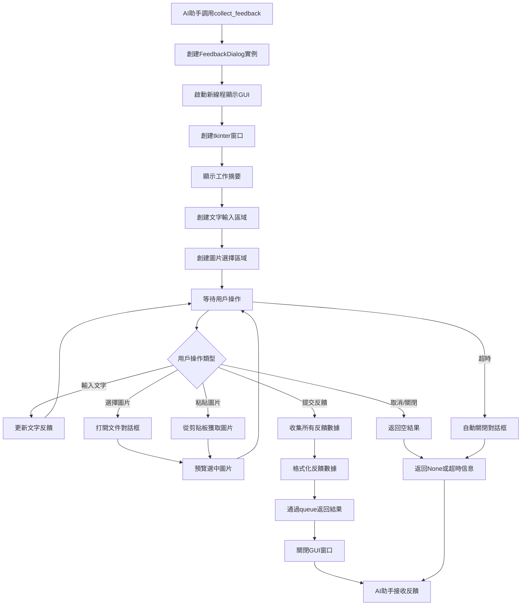
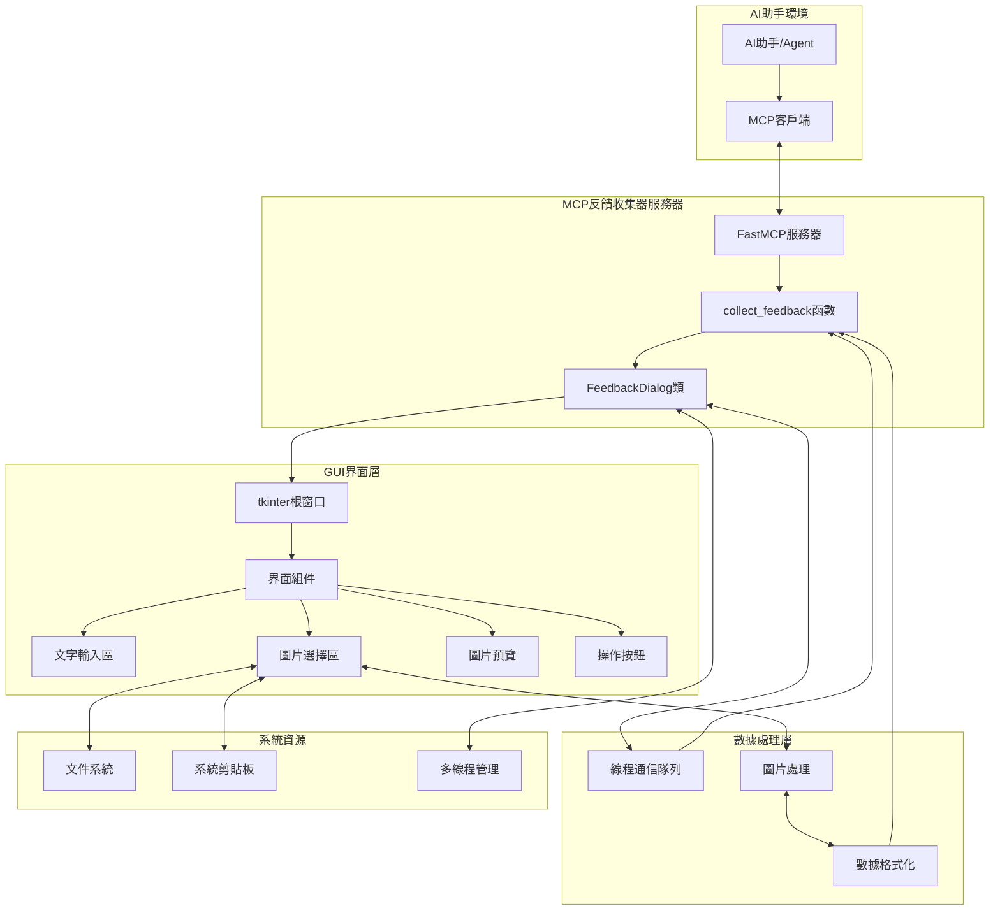

# MCP 反饋收集器 (MCP Feedback Collector)

## 📋 項目概述

MCP 反饋收集器是一個基於 Model Context Protocol (MCP) 的交互式用戶反饋收集系統。它為 AI 助手提供了一個美觀、直觀的 GUI 界面，用於收集用戶的文字和圖片反饋。

### 🎯 主要功能

- **交互式 GUI 界面**：使用 tkinter 構建的現代化用戶界面
- **多種反饋方式**：支持純文字、純圖片、文字+圖片的組合反饋
- **多圖片支持**：可以選擇和預覽多張圖片
- **剪貼板集成**：支持從剪貼板直接粘貼圖片
- **超時控制**：可配置的對話框超時機制
- **線程安全**：使用多線程避免阻塞主程序
- **錯誤處理**：完整的異常處理和用戶友好的錯誤提示

## 🏗️ 系統架構

### 核心組件

1. **FastMCP 服務器**：基於 MCP 協議的服務器實例
2. **FeedbackDialog 類**：負責 GUI 界面的創建和管理
3. **collect_feedback 函數**：MCP 工具函數，對外提供反饋收集服務
4. **線程通信機制**：使用 queue 進行線程間數據傳遞

### 技術棧

| 技術 | 用途 | 版本要求 |
|------|------|----------|
| **Python** | 主要編程語言 | 3.7+ |
| **MCP (Model Context Protocol)** | AI 工具集成協議 | 最新版 |
| **tkinter** | GUI 界面框架 | Python 標準庫 |
| **PIL/Pillow** | 圖片處理 | 8.0+ |
| **threading** | 多線程支持 | Python 標準庫 |
| **queue** | 線程間通信 | Python 標準庫 |

## 📊 工作流程圖



## 🏛️ 系統架構圖



## 🔧 安裝和配置

### 依賴安裝

```bash
pip install pillow mcp-server-fastmcp
```

### 環境變量配置

```bash
# 設置對話框超時時間（秒），默認 300 秒（5分鐘）
export MCP_DIALOG_TIMEOUT=600
```

## 📚 詳細技術說明

### 1. MCP (Model Context Protocol)

**官方文檔**：https://modelcontextprotocol.io/

MCP 是一個開放標準，用於連接 AI 助手與外部工具和數據源。它提供了：
- 標準化的工具調用接口
- 安全的數據傳輸機制
- 可擴展的架構設計

### 2. FastMCP 框架

**GitHub 倉庫**：https://github.com/modelcontextprotocol/python-sdk

FastMCP 是 MCP 的 Python 實現，提供：
- 簡化的服務器創建
- 自動化的工具註冊
- 內置的錯誤處理

### 3. tkinter GUI 框架

**官方文檔**：https://docs.python.org/3/library/tkinter.html

tkinter 是 Python 的標準 GUI 庫，特點：
- 跨平台兼容性
- 豐富的組件庫
- 事件驅動編程模型

### 4. PIL/Pillow 圖片處理

**官方文檔**：https://pillow.readthedocs.io/

Pillow 是 Python 的圖片處理庫，提供：
- 多種圖片格式支持
- 圖片縮放和轉換
- 剪貼板圖片處理

### 5. Python 多線程

**官方文檔**：https://docs.python.org/3/library/threading.html

使用多線程技術實現：
- 非阻塞的 GUI 顯示
- 線程安全的數據傳遞
- 超時控制機制

## 🚀 使用示例

### 基本用法

```python
from feedback_collector import main

# 啟動 MCP 服務器
if __name__ == "__main__":
    main()
```

### AI 助手調用示例

```python
# AI 助手通過 MCP 調用反饋收集
feedback = await mcp_client.call_tool(
    "collect_feedback",
    {
        "work_summary": "我已經完成了網站的多語言功能開發...",
        "timeout_seconds": 300
    }
)
```

## 🔍 核心類和方法詳解

### FeedbackDialog 類

這是系統的核心類，負責創建和管理整個 GUI 界面。

#### 主要方法：

1. **`__init__(work_summary, timeout_seconds)`**
   - 初始化對話框實例
   - 設置工作摘要和超時時間

2. **`show_dialog()`**
   - 在新線程中顯示 GUI
   - 等待用戶操作並返回結果

3. **`create_widgets()`**
   - 創建所有 GUI 組件
   - 設置布局和樣式

4. **`select_images()`**
   - 打開文件選擇對話框
   - 支持多圖片選擇

5. **`paste_from_clipboard()`**
   - 從剪貼板獲取圖片
   - 自動添加到預覽區域

### collect_feedback 函數

這是對外提供的 MCP 工具函數，封裝了整個反饋收集流程。

#### 參數：
- `work_summary`: AI 完成的工作內容摘要
- `timeout_seconds`: 對話框超時時間

#### 返回值：
包含用戶反饋的列表，可能包含文字內容和圖片數據。

## 🛠️ 開發和擴展

### 自定義樣式

可以通過修改 `create_widgets()` 方法中的樣式參數來自定義界面外觀：

```python
# 修改顏色主題
self.root.configure(bg="#your_color")

# 調整字體大小
font=("Arial", 12, "bold")
```

### 添加新功能

1. **新的輸入類型**：可以添加更多輸入組件
2. **數據驗證**：增加輸入數據的驗證邏輯
3. **本地化支持**：添加多語言界面支持

## 📝 許可證

本項目採用 MIT 許可證，詳見 LICENSE 文件。

## 🤝 貢獻指南

歡迎提交 Issue 和 Pull Request 來改進這個項目！

---

*最後更新：2025年1月*
